# Sports Scraper — Project Summary

## Project Overview

Sports Scraper is a desktop application that collects sports news and content from multiple sources (YouTube and BBC Sport), stores the data in a MongoDB database, performs sentiment analysis on the results, and presents them through an interactive GUI.

---

## Application Screenshots & Demo

### 1. Main Screen

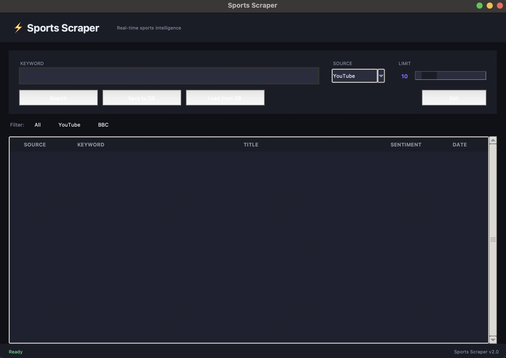

The main screen features a dark-themed modern UI with a search panel at the top (keyword input, source selector, limit slider), filter buttons (All / YouTube / BBC), and a results table with columns: Source, Keyword, Title, Sentiment, and Date.

---

### 2. YouTube Search

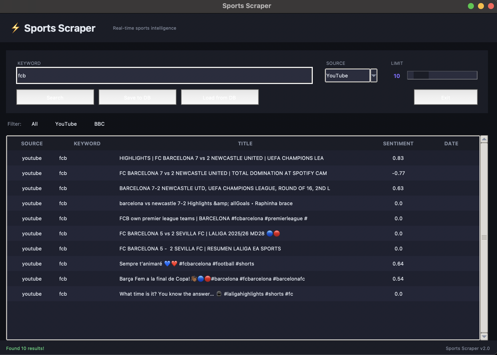

Searching for "fcb" on YouTube returns 10 results including Champions League highlights. Each result shows a sentiment score — for example, the highlight video scored 0.83 (positive) while the "Total Domination" video scored -0.77 (negative).

---

### 3. Saving Results to Database

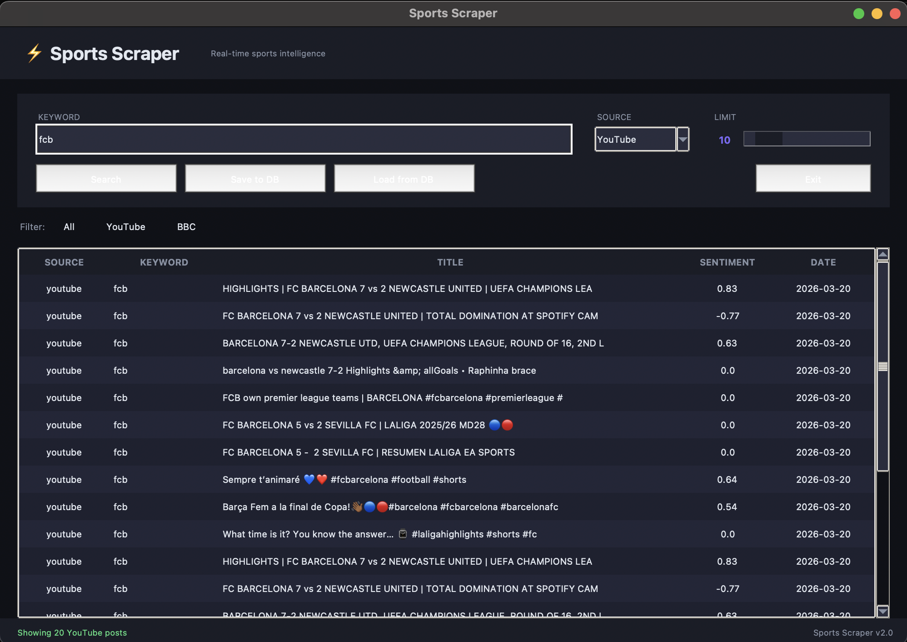

After clicking **Save to DB**, the results are stored in MongoDB. The date column confirms all posts were saved with the current date (2026-03-20). The status bar at the bottom shows "Showing 20 YouTube posts".

---

### 4. BBC Sport Search

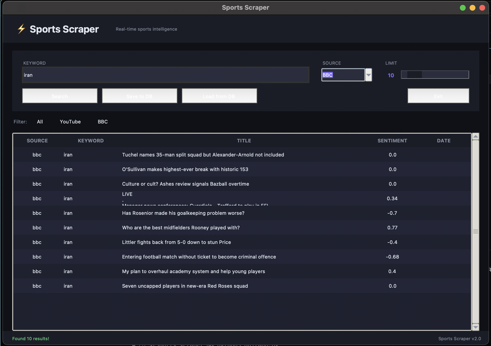

Switching the source to **BBC** and searching for "iran" scrapes headlines from BBC Sport using Selenium. Results include articles like "Tuchel names 35-man split squad" and "O'Sullivan makes highest-ever break". Sentiment varies from 0.77 (positive) to -0.88 (negative).

---

### 5. BBC Search — Champions League

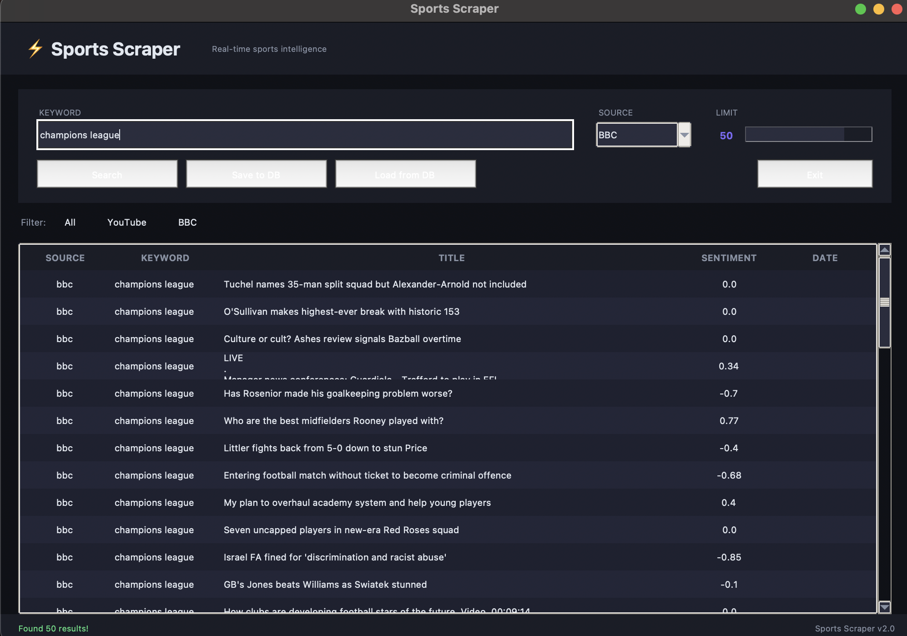

Searching for "champions league" on BBC with a limit of 50 returns a large set of sports headlines. This demonstrates the application's ability to handle larger result sets.

---

### 6. YouTube Search — Champions League

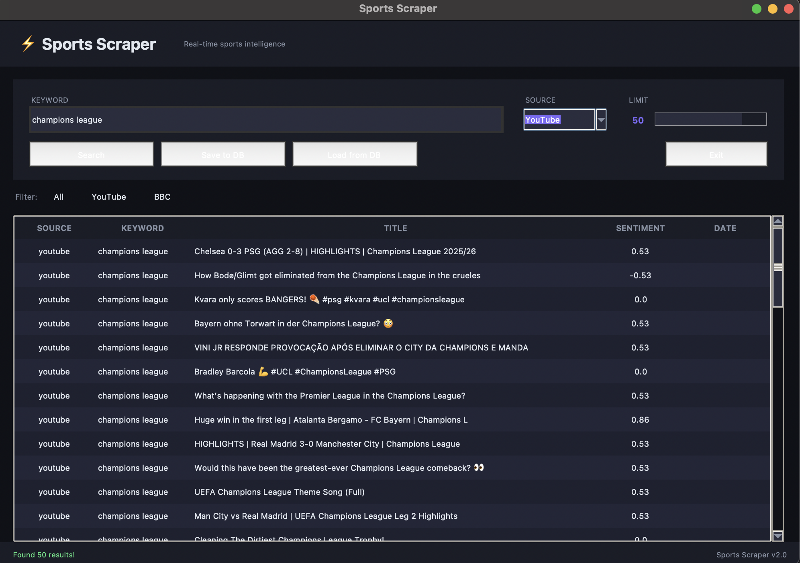

The same "champions league" keyword on YouTube returns video results with sentiment scores. The highest sentiment (0.86) was for "Huge win in the first leg | Atalanta Bergamo – FC Bayern".

---

### 7. Loading Data from Database

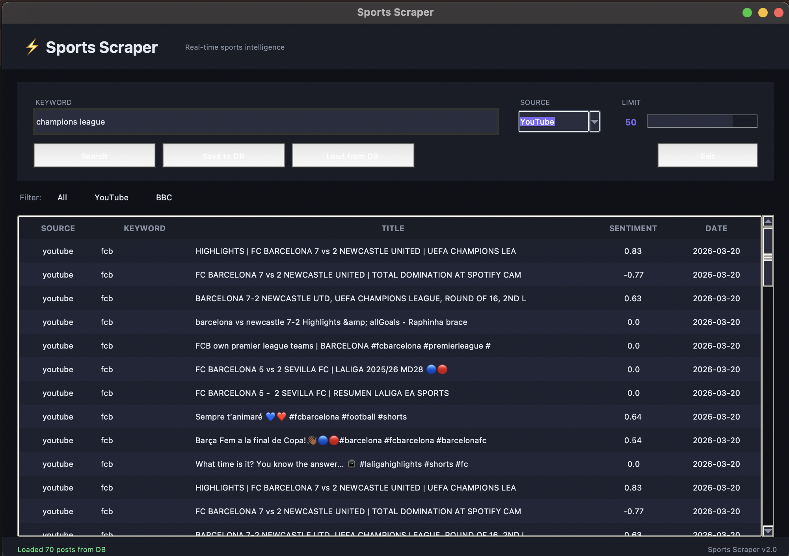

Clicking **Load from DB** retrieves all previously saved posts from MongoDB. The status bar shows "Loaded 70 posts from DB", combining results from multiple search sessions.

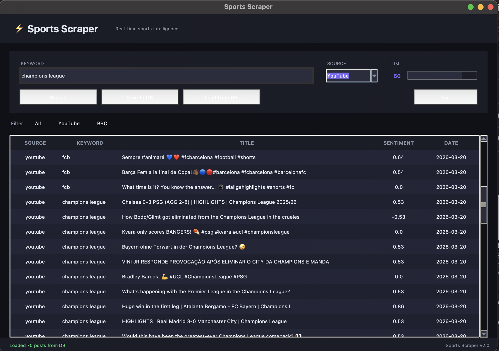

Scrolling through the loaded data shows posts from different keywords (fcb, champions league) all stored together in the database.

---

### 8. Filtering by Source — YouTube Only

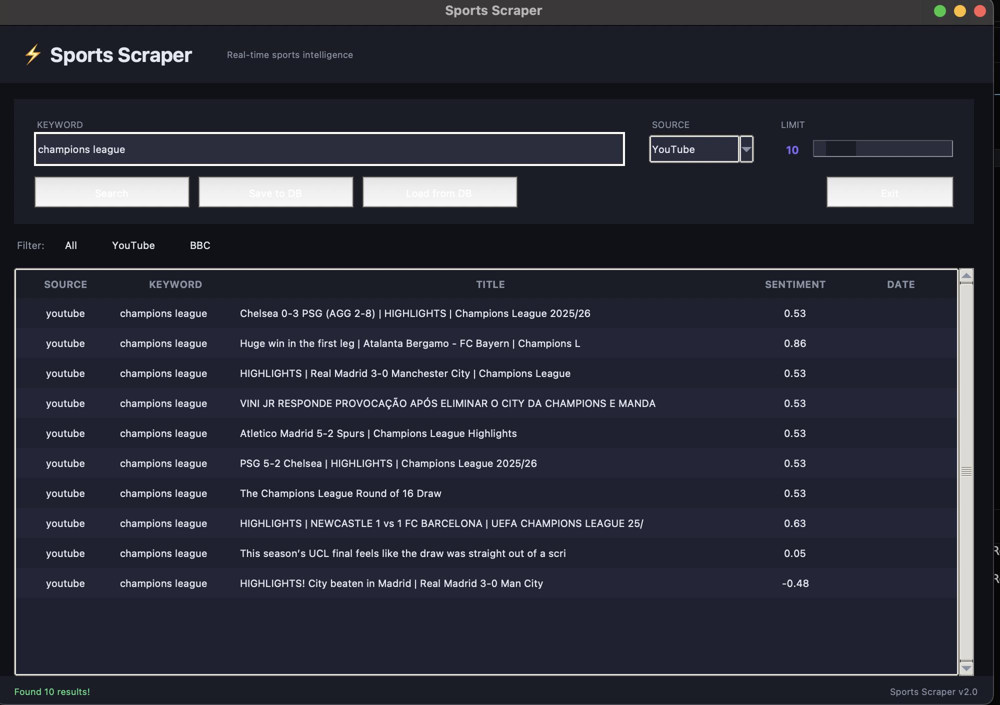

Clicking the **YouTube** filter button filters the loaded results to show only YouTube posts. The limit was set to 10, displaying the top Champions League video results.

---

### 9. Filtering by Source — BBC Only & Save

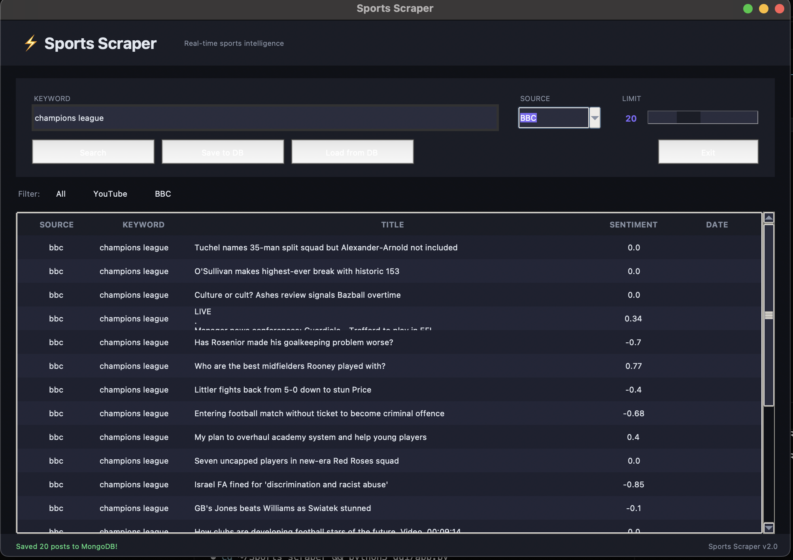

Switching to **BBC** source and saving 20 results to MongoDB. The status bar confirms "Saved 20 posts to MongoDB!".

---

### 10. Loading All Sources Combined

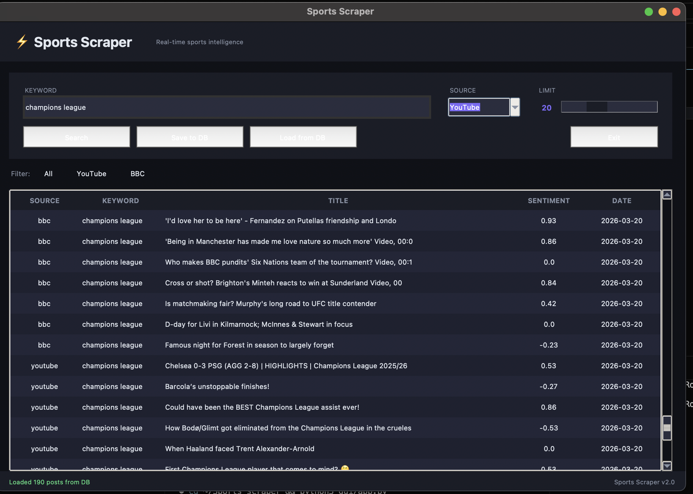

Loading all data from the database shows both BBC and YouTube results together (190 posts total). The **All** filter is active, displaying posts from both sources sorted together. This demonstrates the unified data model — posts from different sources share the same structure.

---

## How We Collect the Data

We used two different ways to get sports data, each one works differently:

### Selenium — Scraping BBC Sport

BBC Sport is a regular website that loads its content with JavaScript. That means if we just try to download the HTML with `requests`, we get an empty page because the content hasn't loaded yet.

So we used **Selenium** — it opens a real Chrome browser (in headless mode, meaning no window pops up), navigates to the BBC Sport page, and waits for everything to load. Once the page is ready, we pass the full HTML to **BeautifulSoup** which pulls out the headlines, links, and text we need.

Basically: Selenium acts like a person opening Chrome and browsing, and BeautifulSoup reads what's on the page.

### YouTube Data API v3 — Getting Data Through an API Key

For YouTube we didn't need to scrape anything. Google gives you an official API (YouTube Data API v3) that lets you search for videos and get back structured data — titles, descriptions, URLs, like counts — all in a clean JSON format.

To use it, we needed to create a project in **Google Cloud Console**, enable the YouTube Data API, and generate an **API key**. This key goes in our `.env` file so it's not exposed in the code. Every time we search, the app sends a request to Google's servers with the keyword and the API key, and Google sends back the results.

The downside is that Google limits how many requests you can make per day (quota), so we can't just spam searches. But the upside is that the data is clean and reliable — no need to parse messy HTML.

### Why We Used Both

We wanted to show two different approaches to collecting data:
- **Selenium** = scraping a website that wasn't built to share its data with us
- **API** = using an official service that was designed to give us data

Both methods end up creating the same `Post` object in our code, so the rest of the app (database, sentiment analysis, GUI) doesn't care where the data came from.

---

## Architecture — MVC Pattern

The project follows the **MVC (Model-View-Controller)** architecture with a service layer:

- **Model** — `Post` dataclass representing a unified data structure for posts from all sources
- **View** — Tkinter-based desktop GUI with threading for non-blocking operations
- **Controller/Service** — `ScraperService` orchestrates the scrapers, database, and sentiment analysis

---

## Tools & Technologies Learned

### Web Scraping

| Tool | Purpose |
|------|---------|
| **Selenium** | Browser automation for scraping dynamic websites (BBC Sport) |
| **BeautifulSoup** | HTML parsing and data extraction from web pages |
| **Google API Client** | Accessing the YouTube Data API v3 for video search |
| **webdriver-manager** | Automatic ChromeDriver installation and management |

**What I learned:** How to scrape both API-based sources (YouTube) and browser-rendered pages (BBC) using different techniques. Selenium handles JavaScript-rendered content that simple HTTP requests cannot access.

### Database

| Tool | Purpose |
|------|---------|
| **MongoDB** | NoSQL database for storing scraped posts |
| **PyMongo** | Python driver for MongoDB operations |

**What I learned:** Working with NoSQL databases — storing unstructured data, querying by fields, and handling collections. MongoDB's flexible schema is ideal for scraped data that may vary between sources.

### Data Analysis & Visualization

| Tool | Purpose |
|------|---------|
| **Pandas** | Data manipulation and analysis |
| **Matplotlib** | Creating charts and plots |
| **Seaborn** | Statistical data visualization |
| **WordCloud** | Generating word clouds from text data |
| **VADER Sentiment** | Sentiment analysis on post titles |
| **Jupyter Notebook** | Interactive EDA environment |

**What I learned:** How to perform exploratory data analysis (EDA) — analyzing distributions, detecting duplicates, visualizing sentiment scores, and generating word clouds. VADER provides sentiment scoring without needing to train a model.

### GUI Development

| Tool | Purpose |
|------|---------|
| **Tkinter** | Desktop GUI framework (built into Python) |
| **Threading** | Running searches in background threads to keep the UI responsive |

**What I learned:** Building a desktop application with a modern dark theme, handling long-running tasks with threads to prevent UI freezing, and displaying data in interactive tables.

### Development Tools

| Tool | Purpose |
|------|---------|
| **python-dotenv** | Loading environment variables from `.env` files |
| **Git & GitHub** | Version control and collaboration |
| **Abstract Base Classes** | Defining a common interface for all scrapers |

**What I learned:** Using design patterns like ABC (Abstract Base Class) to create extensible code — adding a new scraper only requires implementing the `search()` method. Environment variables keep sensitive data (API keys) out of the codebase.

---

## Key Capabilities Demonstrated

1. **Multi-source data collection** — Scraping from both APIs and dynamic websites
2. **Data persistence** — Storing and retrieving data with MongoDB
3. **NLP / Sentiment Analysis** — Automated sentiment scoring using VADER
4. **Data visualization** — Charts, distributions, and word clouds via Jupyter
5. **Desktop GUI** — Interactive application with real-time search and filtering
6. **Clean architecture** — MVC pattern with separation of concerns
7. **Duplicate detection** — Identifying exact and cross-source duplicate posts
